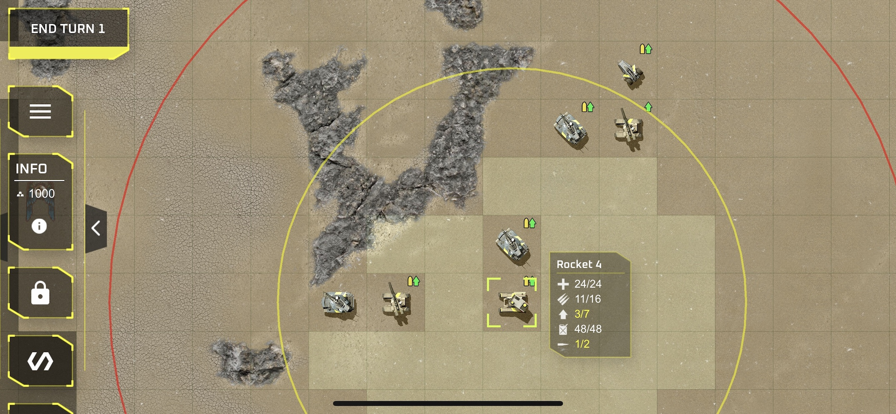

# MACS-resources

Graphic assets and processing tools for MACs new graphics. Compression, load-time optimizations, batch processing and so on. 

Game is written in c/c++ and OpenGL. Platforms: Windows, MacOS, iOS, Android.

## Prerequisits
MacOS, XCode

## Game Screenshot


## Explosion animation


## Build Tools Application

### MacOS

Use Xcode project in the root folder to build and run the game.

To build it, use CMake:

```shell
mkdir -p buildXC
make configure_mac
```

### Windows

Prerequisites:

1. [Visual Studio 2022](https://visualstudio.microsoft.com/vs/) (Community Editon is enough)
1. [CMake](https://cmake.org/download/) (Do not forget to add it to your PATH)

To configure CMake project on Windows, please follow steps:

1. Start Visual Studio 2022, choose "Continue without code" - it will open an empty Visual Studio window;
1. Go "Tools" -> "Command Line" -> "Developer Command Prompt" - it will open a pre-confugured command line window;
1. Navigate to max repo root folder:
 
   ```shell
   cd path\to\macs-resources
   ```

1. Execute the confuiguration script:

    ```shell
    win_configure_work.bat
    ```

    This should create a folder `ToolsForNewGraphics/build` with a `MACS_TOOL.sln` file inside. This is a project solution that you can open with
    Visual Studio 2022.
1. Open `MACS_TOOL.sln` with Visual Studio 2022, find a `Solution Explorer`, find project `MACS_TOOL` on the
   root level, click it with right mouse button and select "Set as Startup Project".
1. Press "Local Windows Debugger" button on top panel to build and run the project. The game should
   be built and run. Switch it to the windowed mode for debigging.

#### Create a shortcut

- Command: `%comspec%`
- Arguments: `/k %comspec% /k "C:\Program Files\Microsoft Visual Studio\2022\Community\VC\Auxiliary\Build\vcvars64.bat"`

### Liunx

Prerequisites:

```shell
sudo apt-get install libfreetype-dev libfontconfig-dev libglew-dev libglfw3-dev libopengl-dev
```
